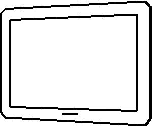
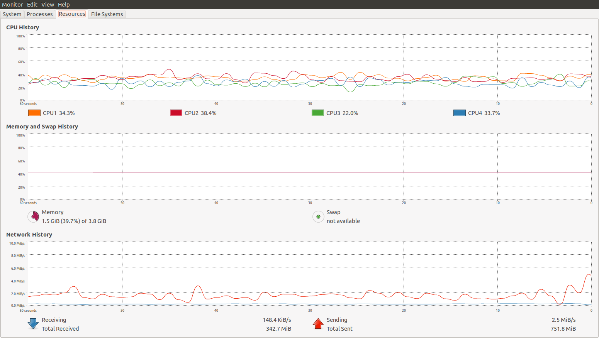

==================
PerformanceAnalyse
==================

1. Local Round
==============

1.1 Messung
-----------

Setup
.....

- 1 Browser
- Sender- und Empfänger-Instanz laufen jeweils in einem Tab
- Datenverkehr macht Roundtripp über Netzwerkkarte
- Externe Services wie STUN-Service und Signalling Channel

Environment
...........

	
- Hardware:
	- Asus UX 31
	- Prozessor: Intel Core i7 2x 1.8 GHz
	- Memory: 3.8 GiB
- Software:
	- Betriebsystem: Ubuntu 12.04 64Bit
	- Browser: Firefox 25
	
	
Resultate
.........

.. figure:: img/messung1.2.1.1.png
   :scale: 75 %
   :align: left
   
   CPU Leistung für einen Stream.
   

   
   Vollständige Rückgabe der CPU an andere Prozesse nach Ende der Übertragung.
   
- Zunahme CPU-Auslastung mit einem Channel: ca 20%
- Zunahme Memory-Verbrauch: ca 1-2%
- Zunahme Netzwerk-Traffic: keine, da local loop
- Video Qualität: 
	- flüssig
	- genug Frames für angenehme Bewegungsdarstellung

- Die Übertragung wird sauber beendet, keine weitere Leistungsaufnahme, sobald der Stream beendet wird.

2 Remote
========

2.1 Messung
-----------

Setup
.....

- 1 Ultrabook, 1 Netbook
- Jeweils gleicher Browser
- Datenverkehr läuft über HSR-WLAN (Problemlos bis zu 10.547 kbit/s (1.318 kByte/s) möglich)

Environment
...........

	
- Ultrabook:
	- Hardware:
		- Asus UX 31
		- Prozessor: Intel Core i7 2x 1.8 GHz
		- Memory: 3.8 GiB
	- Software:
		- Betriebsystem: Ubuntu 12.04, 64Bit
		- Browser: Firefox 25
		

	
- Netbook:
	- Hardware:
		- Samsung NC 10
		- Prozessor: Intel Atom 1.6 GHz
		- Memory: 992 MiB
	- Software:
		- Betriebsystem: Ubuntu 12.10, 32 Bit
		- Browser: Firefox 23
		
		
Resultate
.........

Netbook
^^^^^^^

.. figure:: img/messung2.2.1.1.png
	:scale: 75 %
	:align: left
	
	Das Netbook ist bis an die Leistungsgrenze ausgelastet.
	
- Zunahme CPU-Auslastung: ca 50%
- Zunahme Memory-Verbrauch: nicht spürbar
- Zunahme Netzwerk-Traffic: 10KiB/s out, 15KiB/s in

Qualität
^^^^^^^^
- Video stockend
- Wenige Frames pro Sekunde
- Unbrauchbar für Bewegungsdarstellung
- Audio unbrauchbar
	
	
2.2
---

Setup
.....

- Nur Audio, keine Videoübertragung

Environment
...........

Environment: Gleich wie 2.1

Resultate
.........

Netbook
^^^^^^^

.. figure:: img/messung2.2.2.2.png
	:scale: 75 %
	:align: left
	
	CPU-Belastung des Netbooks durch Audioübertragung
	
- Zunahme CPU-Auslastung: ca 20%
- Zunahme Memory-Verbrauch: nicht spürbar
- Zunahme Netzwerk-Traffic: 7KiB/s in/out

Ultrabook
^^^^^^^^^

.. figure:: img/messung2.2.2.1.png
	:scale: 75 %
	:align: left
	
	CPU-Belastung des Ultrabooks durch Audioübertragung
	
- Zunahme CPU-Auslastung: ca. 10%
- Zunahme Memory-Verbrauch: nicht spürbar
- Zunahme Netzwerk-Trafic: 8 KiB/s out, 7KiB/s in, Abbruch des Streams nach 30s

2.3 Messung
-----------

Setup
.....

- 1 Ultrabook, 1 MacBook
- Jeweils gleicher Browser
- Datenverkehr läuft über HSR-WLAN (Problemlos bis zu 10.547 kbit/s (1.318 kByte/s) möglich)

Environment
...........

- Ultrabook:
	- Hardware:
		- Asus UX 31
		- Prozessor: Intel Core i7 2x 1.8 GHz
		- Memory: 3.8 GiB
	- Software:
		- Betriebsystem: Ubuntu 12.04, 64Bit
		- Browser: Firefox 25

- Macbook:
	- Hardware:
		- MacBook Pro Retina, 2012
		- Prozessor: Intel Core i7 4x 2.3 GHz
		- Memory: 16 GiB
	- Software:
		- Betriebsystem: OS X 10.9 Mavericks
		- Browser: Firefox 24
		
		
Resultate
.........

Ultrabook
^^^^^^^^^

.. figure:: img/messung2.3.1.png
	:scale: 75 %
	:align: left
	
	Ansteigende Datenrate, da beide Geräte entsprechende Videoauflösungen liefern können.
	
- Zunahme CPU-Auslastung: ca 20%
- Zunahme Memory-Verbrauch: nicht spürbar
- Zunahme Netzwerk-Traffic: 50KiB/s, steigend bis 150KiB/s

Qualität
^^^^^^^^
- Flüssige Videoübertragung in beide Richtungen
- Stream des MacBooks zeigt keine wahrnehmbaren Einzelbilder
- Stream des Ultrabooks zeigt bei schnellen Bewegungen Einzelbilder
- Gut geeignet für Bewegungsdarstellung
- Audioübertragung in guter Qualität

3 Mobile - Desktop
==================

3.1 Messung
-----------

Setup
.....

- 1 Tablet, 1 Ultrabook

Environment
...........

- Ultrabook:
	- Hardware:
		- Asus UX 31
		- Prozessor: Intel Core i7 2x 1.8 GHz
		- Memory: 3.8 GiB
	- Software:
		- Betriebsystem: Ubuntu 12.04, 64Bit
		- Browser: Firefox 25
		

	
- Tablet:
	- Hardware:
		- Samsung Galaxy Tab 10.1
		- Prozessor: Nvidia Tegra 2x 1 GHz
		- Memory: 1GB
	- Software:
		- Betriebsystem: Android 4.2.1 32 Bit
		- Browser: Firefox 25
		
		
Resultate
.........

Tablet
^^^^^^

- Zunahme CPU-Auslastung: 70%

Qualität
^^^^^^^^
- Tablet kann Video vom Desktop flüssig wiedergeben, auch der Ton wird korrekt und verständlich wiedergegeben
- Tablet bringt Leistung nicht um eigenes Video parallel zum Remote zu verarbeiten -> eigenes Video friert ein
- Desktop empfängt entsprechend vom Tablet nur ein Standbild

3.2 Messung
-----------

Setup
.....

- 1 Smartphone, 1 Ultrabook

Environment
...........

- Ultrabook:
	- Hardware:
		- Asus UX 31
		- Prozessor: Intel Core i7 2x 1.8 GHz
		- Memory: 3.8 GiB
	- Software:
		- Betriebsystem: Ubuntu 12.04, 64Bit
		- Browser: Firefox 25
		

	
- Smartphone:
	- Hardware:
		- Google Nexus 4
		- Prozessor: Qualcomm Snapdragon S4 Pro 2x 1.5 GHz
		- Memory: 2GB
	- Software:
		- Betriebsystem: Android 4.3 32 Bit
		- Browser: Firefox 25
	
	
Resultate
.........

Qualität
^^^^^^^^
- Video kann sowohl auf dem Phone als auch auf dem Desktop einigermassen flüssig wiedergegeben werden
- Die Video-Auflösung ist relativ gering
- Geeignet für Bewegungsdarstellung

3.3 Messung
-----------

Setup
.....

- 1 Smartphone, 1 Ultrabook

Environment
...........

Gleich wie bei 3.2.
	
	
Resultate
.........

Ultrabook
^^^^^^^^^

	
	Zur Sekunde 25 wird das Smartphone von Widescreen-Ausrichtung nach Portrait gedreht. Dabei wird die Datenrate auf das bereits mehrfach beobachtete Minimum von 40KiB/s gedrosselt und anschliessend langsam hochgefahren.
	

	
	Die Datenrate wird bis auf 300KiB/s hochgefahren, wenn die Geräte dies liefern können. Zur 15. Sekunde findet eine Neuausrichtung des Smartphones statt.
	

	
	Drehung des Smartphone nach Widescreen. Nach 40s erreicht die Auflösung wieder die ursprüngliche Grösse.
	

	
	Ein kurzer Pufferunterlauf zur Sekunde 40 führt daraufhin zu einem Peak. Anschliessend pendelt sich die Datenrate bei 300 KiB/s ein.
	

Qualität
^^^^^^^^
- Wird das Smartphone gedreht, so verändert die Kamera die Auflösung und refreshed den Stream.
- Der Stream wird jeweils neu aufgebaut. Dabei wird er auf 40KiB/s gedrosselt und langsam hochgefahren.
- Dieses automatische Quality Scaling funktioniert nur, wenn das Gerät dies unterstützt.
- Das Smartphone wird während der Kommunikation ziemlich warm und warnt bald vor schrumpfender Akkuleistung.

4. Out of Network
=================

4.1 Messung
-----------

Setup
.....

	
	freegeoip.net zeigt, das das Ultrabook über die HSR verbunden ist und das Smartphone direkt im lokalen WLAN hängt.
	
	
- 1 Smartphone, 1 Ultrabook
- Smartphone direkt über Home-WLAN angebunden
- Ultrabook über Home-WLAN über HSR-VPN angebunden

Environment
...........

- Ultrabook:
	- Hardware:
		- Asus UX 31
		- Prozessor: Intel Core i7 2x 1.8 GHz
		- Memory: 3.8 GiB
	- Software:
		- Betriebsystem: Ubuntu 12.04, 64Bit
		- Browser: Firefox 25
		
		

	
- Smartphone:
	- Hardware:
		- Google Nexus 4
		- Prozessor: Qualcomm Snapdragon S4 Pro 2x 1.5 GHz
		- Memory: 2GB
	- Software:
		- Betriebsystem: Android 4.3 32 Bit
		- Browser: Firefox 25
	
	
Resultate
.........

Ultrabook
^^^^^^^^^

Versuch 4.1.1
.............

	
	Das Ultrabook kann einige wenige KiB/s liefern, das Smartphone sogar nur 1KiB/s.
	
- Zunahme CPU-Auslastung: ca 20%
- Zunahme Memory-Verbrauch: nicht spürbar
- Zunahme Netzwerk-Traffic: 1–5KiB/s
- Sprache teilweise unverständlich

Versuch 4.1.2
.............

	
.. figure:: img/messung4.1.2png
	:scale: 75 %
	:align: left
	
	Die Datenrate fährt hoch bis über 100 KiB/s. Drehung des Smartphones zur Sekunde 55.
	
- Zunahme CPU-Auslastung: ca 20%
- Zunahme Memory-Verbrauch: nicht spürbar
- Zunahme Netzwerk-Traffic: Bis 120KiB/s
- Sprache gut verständlich

Qualität
^^^^^^^^
- Video stockend oder flüssig, je nachdem, ob die Pakete gut durchkommen oder nicht.
- Video-Verzögerung von bis zu ca. 4s
- Smartphone wird etwas warm
- Sprache verständlich oder unverständlich, je nachdem, wie gut die Übertragungsrate ist.

